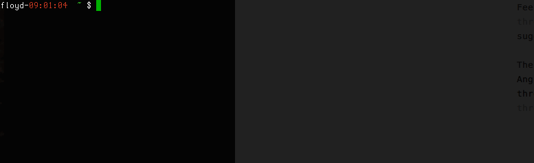

# ThreatConnect Javascript Spaces App Template

**NOTE:** This app is **not** supported by ThreatConnect. While I attempt to keep it up to date and working well, you use it at your own risk.

*Create a ThreatConnect spaces app in less than 30 seconds.*



## Usage

```
cookiecutter https://github.com/fhightower-templates/threatconnect-js-spaces-template.git
```

## Details

Feel free to raise an [issue](https://github.com/fhightower-templates/threatconnect-js-spaces-template/issues) if you find anything wrong or have a suggestion.

There is a similar version of this template to create spaces apps using [Angular](https://angular.io) here: [https://github.com/fhightower-templates/threatconnect-angular-spaces-template](https://github.com/fhightower-templates/threatconnect-angular-spaces-template).
